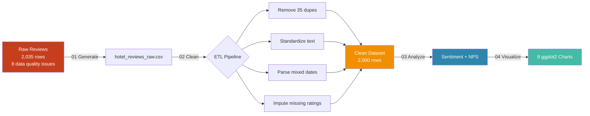
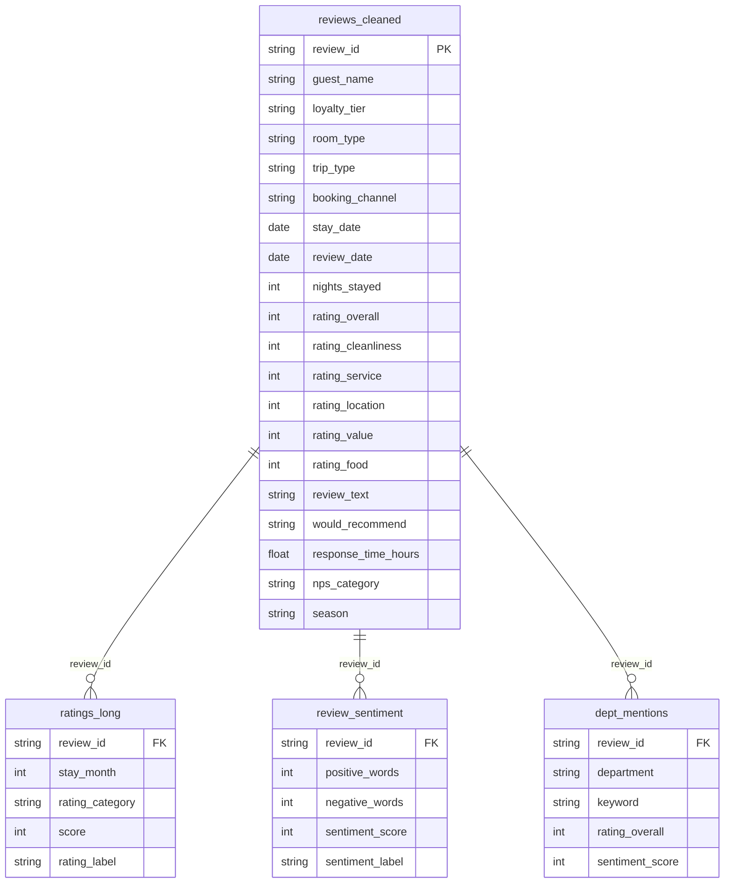
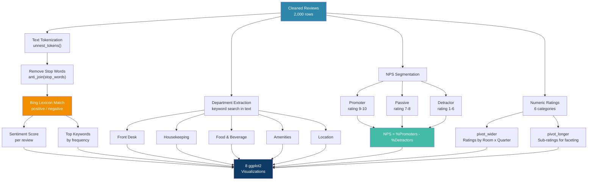

# Hotel Guest Satisfaction & Review Analytics

A text analytics and NPS pipeline that processes 2,000 simulated hotel guest reviews, performs sentiment analysis, calculates Net Promoter Scores, and identifies department-level satisfaction patterns -- built with R, tidyverse, and tidytext.

## Project Overview

This project takes messy guest review data (simulating exports from platforms like TripAdvisor, Medallia, or Revinate), cleans it through an ETL pipeline, then applies text-based sentiment analysis and NPS calculations to surface actionable insights for hotel operations teams.

### Skills Demonstrated
- **Text Analytics**: Sentiment analysis with tidytext and the Bing lexicon
- **NPS Calculation**: Promoter/Passive/Detractor segmentation on a 1-10 scale
- **ETL Pipeline**: Data cleaning, standardization, and structuring
- **Data Wrangling**: tidyverse (dplyr, tidyr, stringr, lubridate)
- **Pivoting**: `pivot_wider` (ratings by room type x quarter) and `pivot_longer` (sub-ratings for faceted plots)
- **Data Visualization**: 8 ggplot2 charts with custom theming
- **Domain Knowledge**: Hotel guest experience terminology (NPS, department satisfaction, response time SLAs)

## Data Pipeline Architecture



## Data Model



## Analytics Methodology Flow



## Key Findings

- **OTA guests rate lower** than direct booking guests -- aligning with industry trends around expectation management
- **Housekeeping and Front Desk** are the most frequently mentioned departments in reviews
- **Fast response times** (under 6 hours) correlate with higher guest satisfaction scores
- **Business travelers** and **couples** tend to give higher ratings than family travelers
- **Spring and Fall** show highest satisfaction, matching DC's peak tourism seasons

## Analytics Methodology

### Net Promoter Score (NPS)
| Category | Rating Range | Meaning |
|----------|-------------|---------|
| Promoter | 9 - 10 | Loyal guests who will recommend |
| Passive | 7 - 8 | Satisfied but not enthusiastic |
| Detractor | 1 - 6 | Unhappy guests who may leave negative reviews |

**NPS = % Promoters - % Detractors** (ranges from -100 to +100)

### Sentiment Analysis
- Reviews are tokenized into individual words using `unnest_tokens()`
- Stop words removed (the, a, is, etc.)
- Each word scored using the **Bing sentiment lexicon** (positive/negative)
- Review-level sentiment = positive word count - negative word count

### Department-Level Analysis
Reviews are scanned for keyword mentions of 5 hotel departments:
| Department | Keywords Tracked |
|-----------|-----------------|
| Front Desk | check-in, reception, receptionist, check-out |
| Housekeeping | clean, towels, bathroom, spotless |
| Food & Beverage | breakfast, restaurant, food, bar, dining, room service |
| Amenities | pool, gym, spa, wifi, business center |
| Location | location, metro, walking distance, nearby |

## Dataset Details

The raw dataset simulates a guest review export with deliberate data quality issues:

| Issue | Description |
|-------|-------------|
| Mixed date formats | `YYYY-MM-DD` and `MM/DD/YYYY` in same column |
| Inconsistent casing | Guest names and room types in mixed case |
| Missing values | ~3-6% NAs across sub-ratings and loyalty tier |
| Whitespace | Leading/trailing spaces in channels and trip types |
| Duplicates | 35 exact duplicate rows |
| Missing responses | ~15% of reviews have no hotel response time |

### Rating Categories (1-10 scale)
- **Overall** - General satisfaction
- **Cleanliness** - Room and property cleanliness
- **Service** - Staff friendliness and responsiveness
- **Location** - Convenience and surroundings
- **Value** - Price-to-quality perception
- **Food & Beverage** - Dining and bar quality

## Visualizations

Eight ggplot2 charts saved to `output/plots/`:

| # | Chart | Description |
|---|-------|-------------|
| 1 | Monthly Satisfaction Trend | Line chart tracking average rating over 12 months |
| 2 | NPS by Month | Stacked bar showing Promoter/Passive/Detractor mix |
| 3 | Department Satisfaction | Horizontal bar of avg rating by department |
| 4 | Sentiment Keywords | Diverging bar of top positive/negative review words |
| 5 | Rating Distribution | Histogram colored by NPS category |
| 6 | Satisfaction by Trip Type | Boxplot comparing Business/Leisure/Family/Couple/Solo |
| 7 | Sub-Rating Dashboard | Faceted line charts using `pivot_longer` output |
| 8 | Correlation Heatmap | How rating categories relate to each other |

### Sample Outputs

<p align="center">
  
  
</p>
<p align="center">
  
  
</p>

## Project Structure

```
hotel-guest-analytics/
├── data/
│   ├── raw/hotel_reviews_raw.csv           # 2,000+ rows, messy raw data
│   └── processed/                          # Cleaned + analytics CSVs
│       ├── reviews_cleaned.csv
│       ├── reviews_with_sentiment.csv
│       ├── monthly_summary.csv
│       ├── channel_summary.csv
│       ├── loyalty_summary.csv
│       ├── dept_satisfaction.csv
│       ├── nps_monthly.csv
│       ├── nps_by_trip_type.csv
│       ├── top_positive_words.csv
│       ├── top_negative_words.csv
│       ├── response_impact.csv
│       ├── rating_room_quarter.csv
│       └── ratings_long.csv
├── scripts/
│   ├── 01_generate_reviews.R              # Review dataset generation
│   ├── 02_clean_and_structure.R           # ETL cleaning & structuring
│   ├── 03_sentiment_analytics.R           # Sentiment, NPS & department analysis
│   └── 04_visualizations.R               # 8 ggplot2 charts
├── output/plots/                          # Saved PNG charts
└── README.md
```

## How to Run

### Prerequisites
- R (>= 4.0)
- RStudio (recommended)

```r
install.packages(c("tidyverse", "lubridate", "scales", "tidytext"))
```

### Execution Order

```r
setwd("path/to/hotel-guest-analytics")

source("scripts/01_generate_reviews.R")       # Generate raw review data
source("scripts/02_clean_and_structure.R")     # Clean and structure
source("scripts/03_sentiment_analytics.R")     # Sentiment + NPS analysis
source("scripts/04_visualizations.R")          # Create all 8 charts
```

## Related Project

**[Hotel Revenue Analytics Pipeline](https://github.com/behaldeepanshi01-gif/hotel-revenue-analytics)** - Companion project covering the revenue side: ETL pipeline, star schema, ADR/RevPAR/Occupancy KPIs, and 8 revenue-focused visualizations.

Together, these two projects demonstrate full-stack hotel data analytics:
- **Revenue Analytics** = "How is the hotel performing financially?"
- **Guest Analytics** = "How do guests feel about their experience?"

## Technologies

- **R** with tidyverse (dplyr, tidyr, ggplot2, readr, stringr)
- **tidytext** for text mining and sentiment analysis
- **lubridate** for date parsing
- **scales** for formatted axis labels

## Glossary

| Term | Definition |
|------|-----------|
| NPS | Net Promoter Score -- measures guest loyalty and likelihood to recommend |
| Sentiment Analysis | Using text data to determine positive/negative tone |
| Bing Lexicon | Dictionary of ~6,800 words labeled as positive or negative |
| Sub-Rating | Individual rating category (cleanliness, service, etc.) |
| Response Time | Hours between review posting and hotel management response |
| Detractor | Guest rating 1-6 who is likely to leave negative feedback |
| Promoter | Guest rating 9-10 who will actively recommend the hotel |
