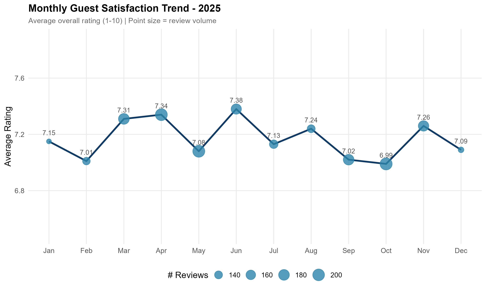
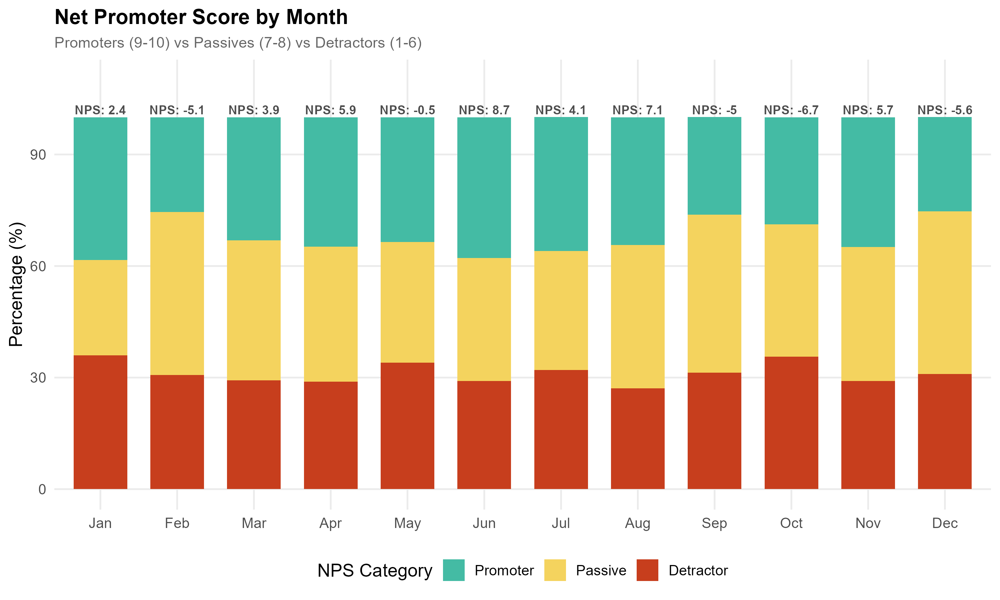
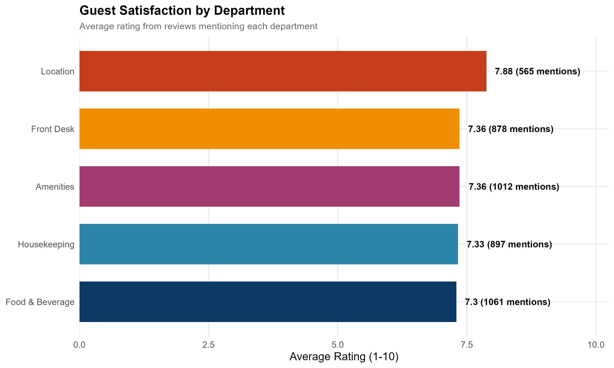
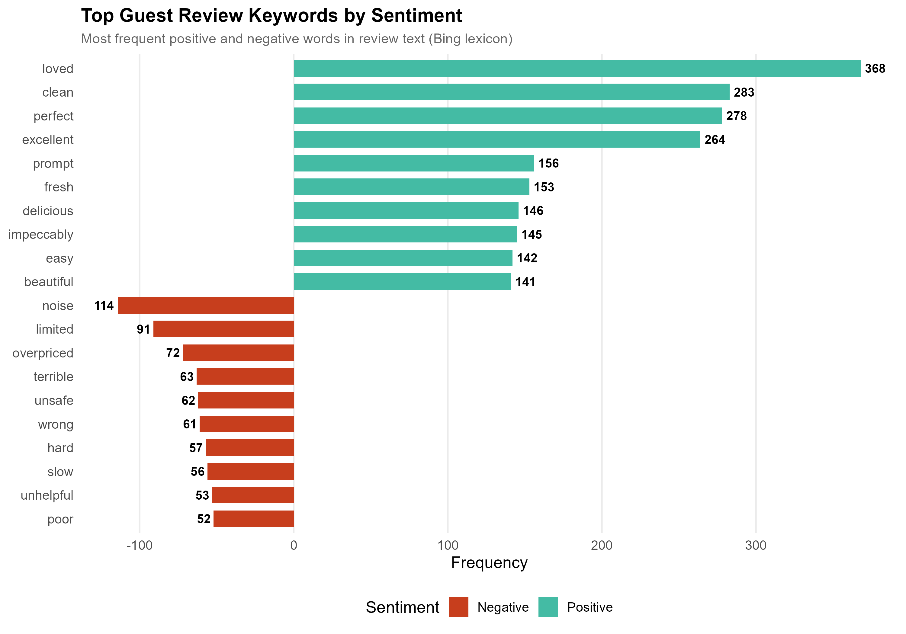
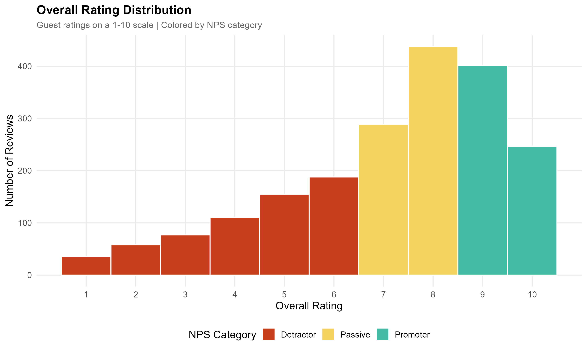
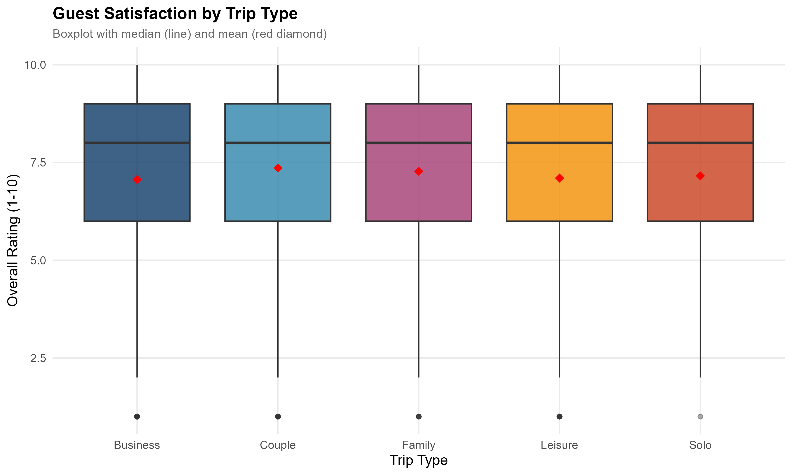
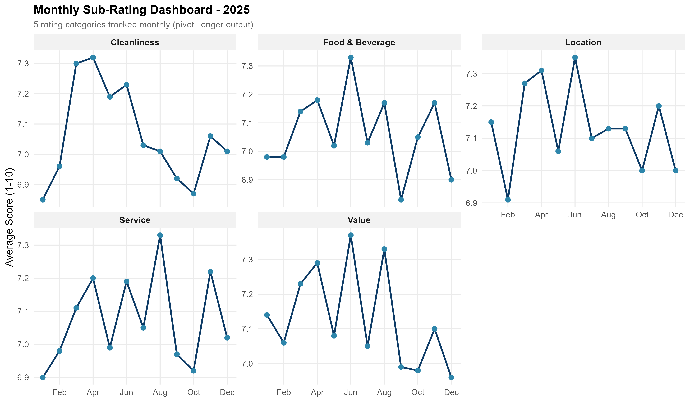
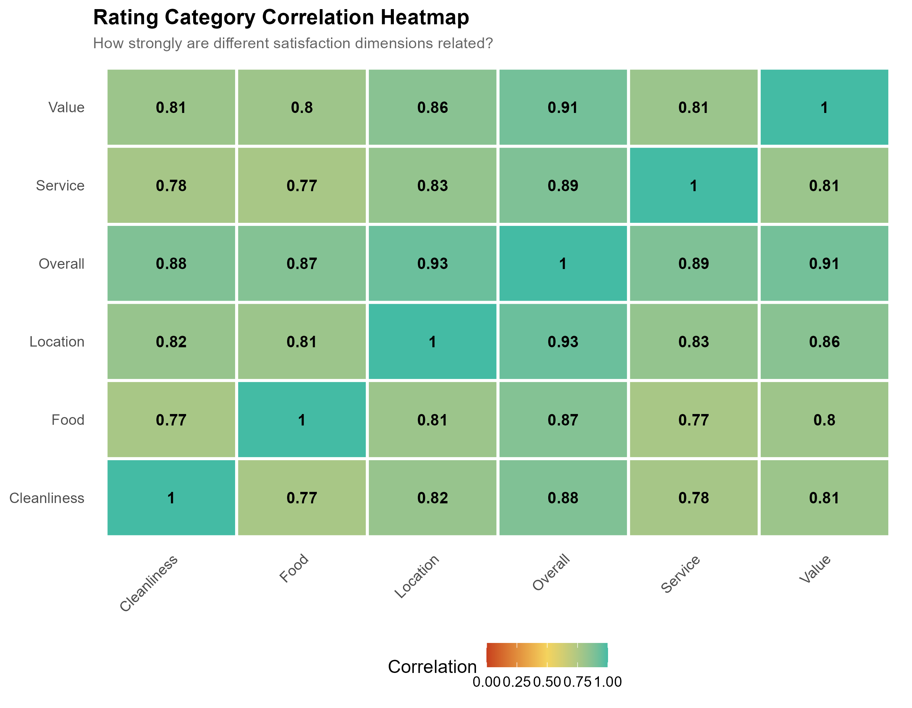

# Hotel Guest Satisfaction & Review Analytics

> Text analytics and NPS pipeline processing 2,000 guest reviews — sentiment analysis, Net Promoter Score tracking, and department-level satisfaction modeling with 8 visualizations.


## Business Context

Hotels collect thousands of guest reviews across channels (OTA, direct, surveys) but struggle to extract actionable insights at scale. This project processes 2,000 reviews through a complete NLP and statistical pipeline to answer: Which departments drive satisfaction? Do OTA guests rate differently than direct bookers? How does response time affect scores? What seasonal patterns exist?

## Dashboards

| | |
|:---:|:---:|
|  |  |
| **Satisfaction Score Trend** | **Net Promoter Score by Month** |
|  |  |
| **Department Satisfaction** | **Sentiment Keyword Analysis** |
|  |  |
| **Rating Distribution** | **Satisfaction by Trip Type** |
|  |  |
| **Sub-Rating Dashboard** | **Correlation Heatmap** |

## Key Findings

| Metric | Value | Insight |
|--------|-------|---------|
| OTA vs Direct | **Lower OTA scores** | OTA guests rate lower than direct bookers |
| Top Departments | **Housekeeping & Front Desk** | Most frequently mentioned in reviews |
| Response Time | **Faster = Higher scores** | Significant positive correlation |
| Seasonal Peaks | **Spring & Fall** | Tourism seasons show highest satisfaction |
| NPS Segmentation | **3 categories** | Promoters, Passives, Detractors tracked monthly |

## Project Structure

```
hotel-guest-analytics/
├── scripts/
│   └── guest_satisfaction_pipeline.R     # Complete NLP + analysis pipeline
├── output/
│   └── plots/                            # 8 publication-ready visualizations
├── .gitignore
└── README.md
```

## How to Run

```r
# Requires R >= 4.0 with: tidyverse, tidytext, lubridate, scales
# Run the full pipeline:
source("scripts/guest_satisfaction_pipeline.R")
```

## Tools Used

- **R** (tidyverse): dplyr, tidyr, ggplot2, readr, stringr
- **tidytext**: Sentiment lexicon analysis (Bing, AFINN)
- **lubridate**: Date standardization
- **NLP Methods**: Sentiment scoring, keyword extraction, NPS calculation

## Author

**Deepanshi Behal** | [LinkedIn](https://linkedin.com/in/bdeepanshi) | [GitHub](https://github.com/behaldeepanshi01-gif)
