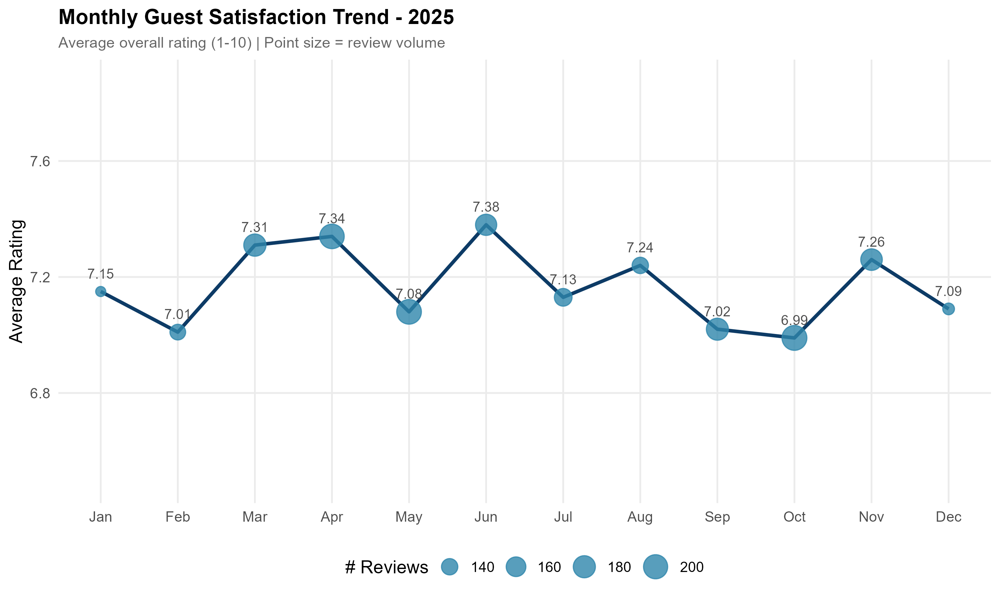
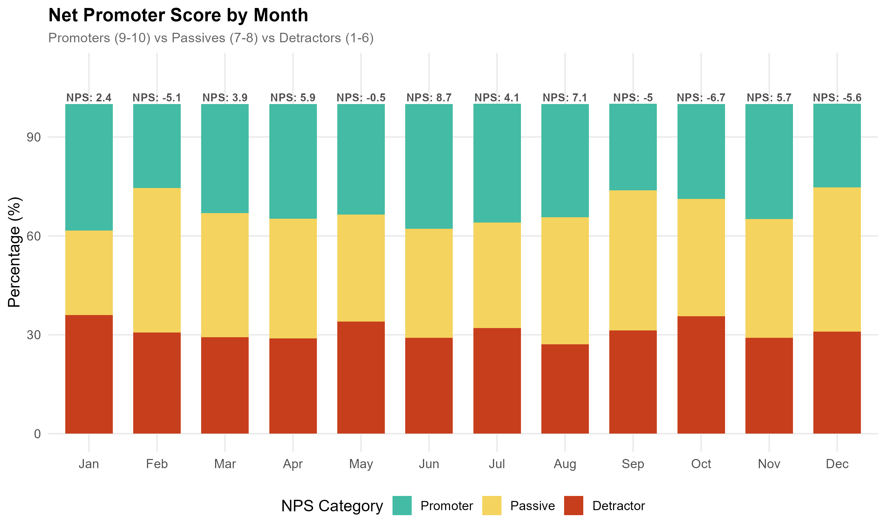
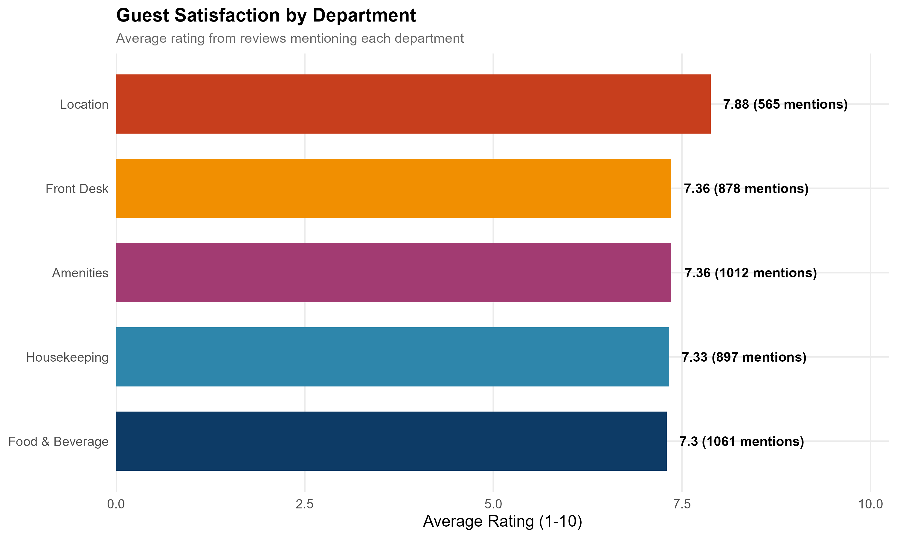
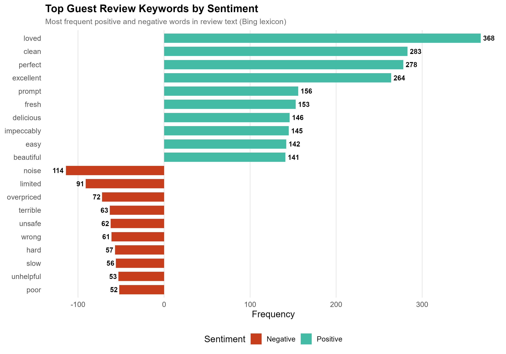
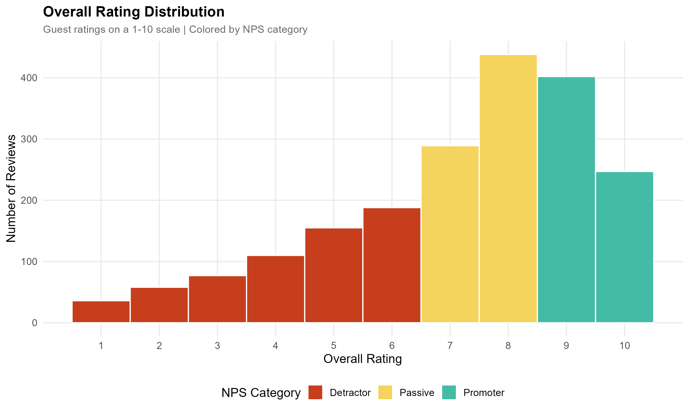
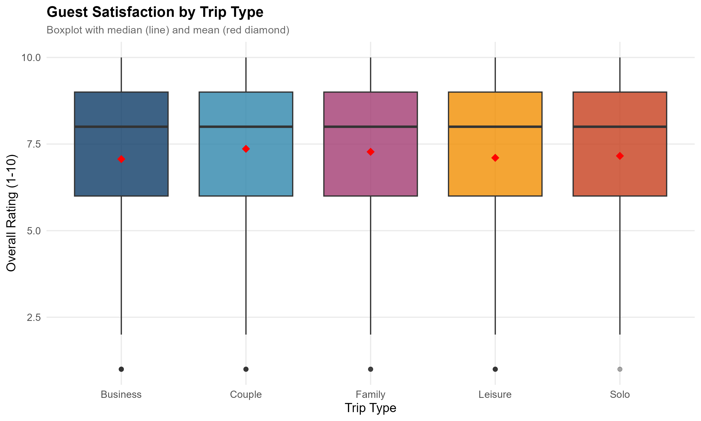
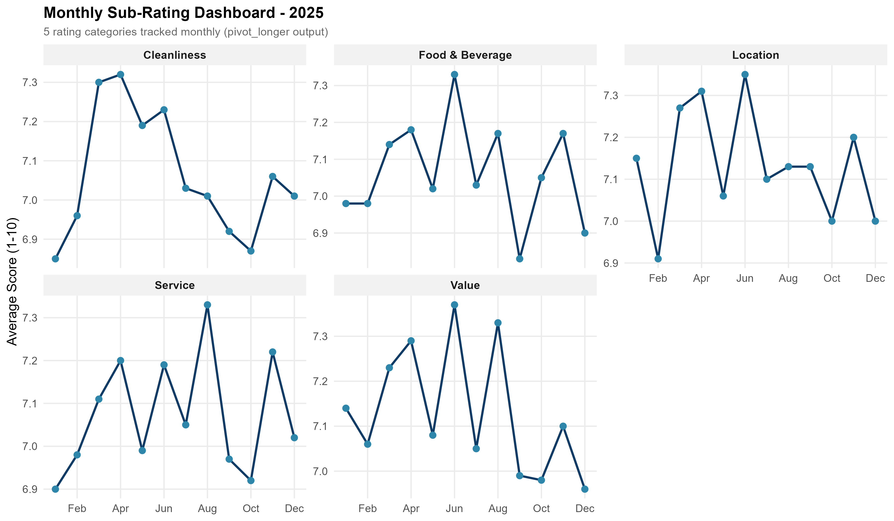
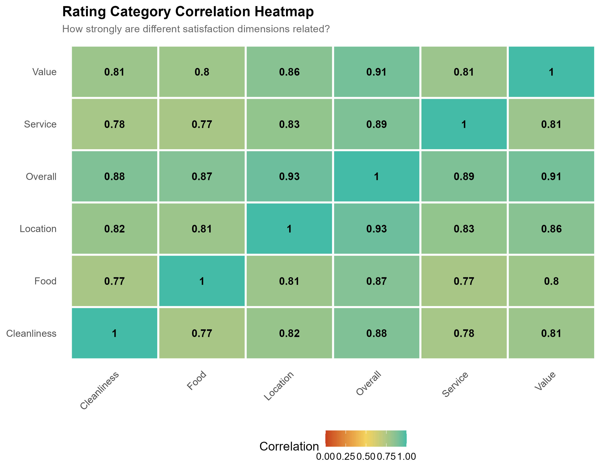

# Hotel Guest Satisfaction & Review Analytics

> Text analytics and NPS pipeline processing 2,000 guest reviews — sentiment analysis, Net Promoter Score tracking, and department-level satisfaction modeling with 8 visualizations.


## Business Context

Hotels collect thousands of guest reviews across channels (OTA, direct, surveys) but struggle to extract actionable insights at scale. This project processes 2,000 reviews through a complete NLP and statistical pipeline to answer: Which departments drive satisfaction? Do OTA guests rate differently than direct bookers? Does response time affect scores? Are there seasonal patterns?

## Dashboards

| | |
|:---:|:---:|
|  |  |
| **Satisfaction Score Trend** | **Net Promoter Score by Month** |
|  |  |
| **Department Satisfaction** | **Sentiment Keyword Analysis** |
|  |  |
| **Rating Distribution** | **Satisfaction by Trip Type** |
|  |  |
| **Sub-Rating Dashboard** | **Correlation Heatmap** |

## Key Findings (simulated data)

| Question | Result | Takeaway |
|----------|--------|----------|
| How do guests feel overall? | **60.4% positive**, 31.2% neutral, 8.3% negative reviews | Sentiment is healthy, but NPS is only **+1.2** |
| What do guests complain about? | Top negative words: **noise, limited, overpriced** | Noise and perceived value are the fixable issues |
| Which department scores best and worst? | **Location** 7.88 avg (85% positive) vs **Food & Beverage** 7.30 (76% positive) | F&B is mentioned most and scores lowest |
| Who are the happiest guests? | **Couples** NPS +8.5 vs **Business** travelers −1.5 | Business travelers need attention |
| When is NPS strongest? | **June** +8.7, weakest **October** −6.8 | Month-to-month swings, no clear seasonal pattern |
| Do OTA guests rate lower than direct? | **No.** OTA 7.21 vs Direct 7.04 (Welch t-test, p = 0.23) | Channel does not drive satisfaction here |
| Does faster review response lift scores? | **No.** r = 0.00 between response hours and rating | Response speed alone is not the lever |

> Data is simulated with a fixed random seed, so results are reproducible. Hypotheses were tested, and findings are reported as the data shows them, including the ones that did not hold.

## Project Structure

```
hotel-guest-analytics/
├── scripts/
│   ├── 01_generate_reviews.R        # Simulates 2,000 messy guest reviews
│   ├── 02_clean_and_structure.R     # Cleans text, dates, ratings; builds NPS categories
│   ├── 03_sentiment_analytics.R     # Bing sentiment, departments, NPS, response time
│   └── 04_visualizations.R          # 8 ggplot2 charts saved to output/plots
├── output/
│   └── plots/                       # 8 publication-ready visualizations
├── .gitignore
└── README.md
```

## How to Run

Requires R >= 4.0 with `tidyverse`, `tidytext`, `lubridate` and `scales`. From the project folder:

```bash
Rscript scripts/01_generate_reviews.R
Rscript scripts/02_clean_and_structure.R
Rscript scripts/03_sentiment_analytics.R
Rscript scripts/04_visualizations.R
```

The scripts create the `data/` and `output/` folders automatically.

## Tools Used

- **R** (tidyverse): dplyr, tidyr, ggplot2, readr, stringr
- **tidytext**: Sentiment lexicon analysis (Bing, AFINN)
- **lubridate**: Date standardization
- **NLP Methods**: Sentiment scoring, keyword extraction, NPS calculation

## Author

**Deepanshi Behal** | [LinkedIn](https://linkedin.com/in/bdeepanshi) | [GitHub](https://github.com/behaldeepanshi01-gif)
